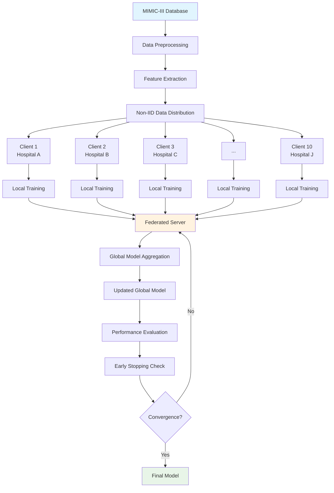

# Federated Learning for Patient Mortality Prediction using Neural Networks on MIMIC-III

[](https://www.python.org/)
[](https://pytorch.org/)
[](https://opensource.org/licenses/MIT)
[](https://mimic.mit.edu/)

> A comprehensive implementation of federated learning applied to patient mortality prediction using the MIMIC-III clinical database, demonstrating privacy-preserving machine learning in healthcare.

## Table of Contents
- [Overview](#overview)
- [Architecture](#architecture)
- [Clinical Features](#clinical-features)
- [Implementation Details](#implementation-details)
- [Getting Started](#getting-started)
- [Results](#results)
- [Contributing](#contributing)
- [Resources](#resources)

## Overview

This project implements a federated learning system for patient mortality prediction, enabling multiple healthcare institutions to collaboratively train neural networks while maintaining strict data privacy. The system processes clinical data from the MIMIC-III database and distributes training across multiple simulated clients.

### Key Features

- **Privacy-Preserving**: No raw data sharing between clients
- **Realistic Distribution**: Non-IID data distribution across 10 federated clients
- **Clinical Relevance**: 17 critical clinical indicators for mortality prediction
- **Performance Monitoring**: Comprehensive metrics tracking and early stopping
- **Scalable Architecture**: Easily configurable for different scenarios

## Architecture



### System Components

| Component | Description |
|-----------|-------------|
| **Data Preprocessor** | Extracts and normalizes clinical features from MIMIC-III |
| **Client Manager** | Handles local training across distributed clients |
| **Federated Server** | Coordinates global model aggregation using FedAvg |
| **Performance Monitor** | Tracks metrics and implements early stopping |

## Clinical Features

The system extracts 17 critical clinical indicators across multiple domains:

### Neurological Assessment
```
Glasgow Coma Scale (GCS)
├── GCS Verbal Response
├── GCS Motor Response
├── GCS Eye Opening
└── Total GCS Score
```

### Vital Signs Monitoring
- **Cardiovascular**: Systolic Blood Pressure, Heart Rate
- **Thermoregulation**: Body Temperature (°F → °C conversion)

### Respiratory Function
- **PaO₂/FiO₂ Ratio**: Primary respiratory failure indicator
- **Individual Components**: PaO₂ and FiO₂ measurements

### Laboratory Values
| Category | Parameters |
|----------|------------|
| **Hematology** | White Blood Cell Count (WBC) |
| **Biochemistry** | Bicarbonate, Sodium, Potassium, Bilirubin |
| **Renal Function** | Blood Urea Nitrogen (BUN) |
| **Fluid Balance** | Urine Output |

## Implementation Details

### Neural Network Architecture

```python
class MortalityPredictor(nn.Module):
    def __init__(self):
        super().__init__()
        self.layers = nn.Sequential(
            nn.Linear(17, 64),      # Input: 17 clinical features
            nn.ReLU(),
            nn.Dropout(0.5),        # Regularization
            nn.Linear(64, 1),       # Output: Binary classification
            nn.Sigmoid()
        )
```

### Training Configuration

| Parameter | Value | Description |
|-----------|-------|-------------|
| **Clients** | 10 | Simulated healthcare institutions |
| **Local Epochs** | 10 | Training rounds per client |
| **Hidden Units** | 64 | Neural network capacity |
| **Dropout Rate** | 0.5 | Overfitting prevention |
| **Initialization** | Kaiming | Optimal weight initialization |

### Federated Learning Process

1. **Initialization**: Global model parameters distributed to clients
2. **Local Training**: Each client trains on private data
3. **Parameter Sharing**: Only model weights are transmitted
4. **Aggregation**: FedAvg algorithm combines client updates
5. **Evaluation**: Performance metrics calculated on test sets
6. **Iteration**: Process repeats until convergence

## Getting Started

### Prerequisites

```bash
pip install pandas numpy matplotlib torch scikit-learn
```

### Data Requirements

- **MIMIC-III Clinical Database Demo** (version 1.4)
- **Required Tables**: CHARTEVENTS, LABEVENTS, OUTPUTEVENTS, ADMISSIONS
- **Access**: Requires PhysioNet credentialed access

### Quick Start

```python
# 1. Data Preprocessing
processor = DataPreprocessor()
features, labels = processor.extract_features()

# 2. Client Creation
clients = create_federated_clients(features, labels, num_clients=10)

# 3. Training
server = FederatedServer(model_architecture)
results = server.train(clients, rounds=100)

# 4. Evaluation
visualize_results(results)
```

## Results

### Performance Metrics

The federated learning system demonstrates:

- **Training Accuracy**: Progressive improvement across rounds
- **Test Accuracy**: Robust generalization to unseen data
- **Loss Convergence**: Stable training dynamics
- **Early Stopping**: Automatic convergence detection

### Data Distribution Analysis

```
Client Distribution (Non-IID)
├── Client 1: 15.2% (Class 0: 87%, Class 1: 13%)
├── Client 2: 12.8% (Class 0: 91%, Class 1: 9%)
├── Client 3: 18.5% (Class 0: 82%, Class 1: 18%)
└── ...
```


## Resources

### Publications & Articles

- **Medium Article**: [Federated Learning: The Future of Privacy-Preserving AI](https://medium.com/@ly_dinari/federated-learning-the-future-of-privacy-preserving-ai-813540631b3d)
- **MIMIC-III Documentation**: [PhysioNet](https://mimic.mit.edu/)
- **Federated Learning Survey**: [arXiv:1912.04977](https://arxiv.org/abs/1912.04977)

### Technical References

- **PyTorch Documentation**: [pytorch.org](https://pytorch.org/docs/)
- **Federated Averaging**: McMahan et al., 2017
- **Healthcare AI Ethics**: [Nature Medicine Guidelines](https://www.nature.com/articles/s41591-019-0548-6)

### Dataset Information

- **MIMIC-III**: Critical care database with de-identified health data
- **Access**: Requires completion of CITI training program
- **License**: PhysioNet Credentialed Health Data License

---

## Acknowledgments

- **MIT Laboratory for Computational Physiology** for MIMIC-III database
- **PhysioNet** for data access infrastructure
- **Healthcare AI Research Community** for federated learning advances

## Contact

For questions, suggestions, or collaboration opportunities, please open an issue or reach out through the Medium article comments.

---

*This implementation demonstrates the potential of federated learning in healthcare, enabling collaborative AI development while maintaining strict data privacy and security standards.*
